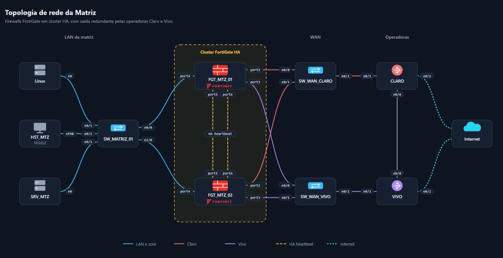
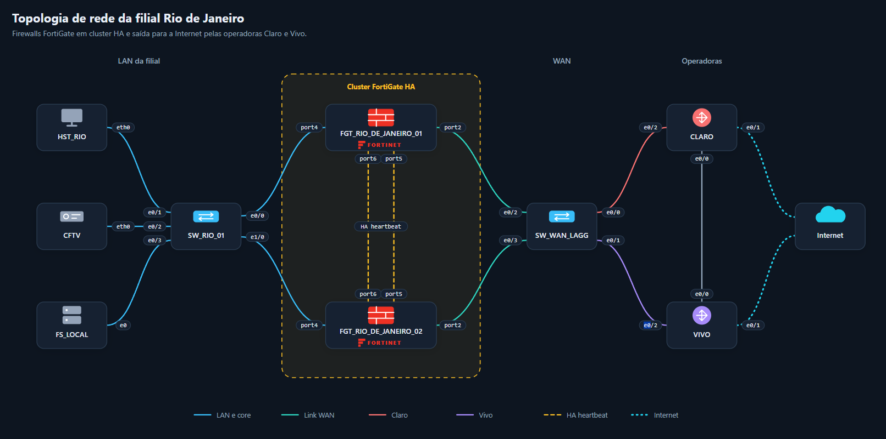
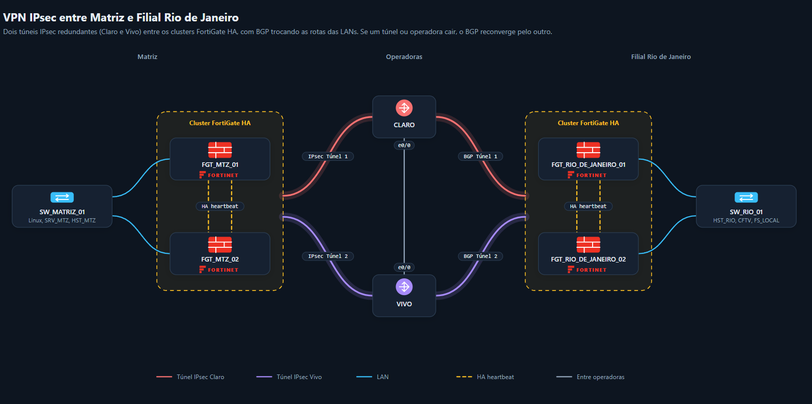

# FortiGate HA + Dual WAN + SD-WAN + BGP + IPsec

Implementação de FortiGate HA Active-Passive na Matriz, integrado a Dual WAN, SD-WAN, BGP e VPN IPsec. O laboratório valida sincronização do cluster e failover automático entre os firewalls, mantendo a comunicação entre Matriz e Rio de Janeiro.

**Status: EM DESENVOLVIMENTO.** O HA da Matriz e da filial Rio de Janeiro está implementado e validado, incluindo failover nos dois sentidos e ressincronização automática no Rio. A implementação de AGG/LACP na WAN ainda será ajustada.

**Resultado dos testes:** 2 pacotes ICMP perdidos em cada um dos dois testes de desligamento do firewall ativo, com retomada das respostas após a eleição do outro membro.

## Visão geral

Laboratório virtual no PNETLab com dois FortiGates na Matriz, dois provedores (Claro e Vivo), switches WAN dedicados e comunicação com o Rio de Janeiro. O HA foi acrescentado ao ambiente de Dual WAN, SD-WAN, BGP e IPsec já utilizado no laboratório.

| Componente | Implementação |
|---|---|
| Firewalls da Matriz | FGT_MTZ_01 e FGT_MTZ_02 |
| HA (High Availability) | Active-Passive com FGCP (FortiGate Clustering Protocol) |
| Heartbeat | Dois enlaces diretos: port4 ↔ port4 e port5 ↔ port5 |
| LAN (Local Area Network) | SW_MATRIZ com trunks 802.1Q para VLANs 10, 20 e 30 |
| Dual WAN (Wide Area Network) | Claro e Vivo, cada uma com seu próprio switch Layer 2 |
| SD-WAN (Software-Defined Wide Area Network) | Seleção de caminhos entre Claro e Vivo |
| BGP (Border Gateway Protocol) | Roteamento dinâmico entre os sites |
| VPN (Virtual Private Network) IPsec (Internet Protocol Security) | Túneis CLARO_TO_RJ e VIVO_TO_RJ |
| Validação | Sincronização, eleição, retorno do membro e failover nos dois sentidos |

## Topologia

### Filial Rio de Janeiro

A correspondência entre os rótulos PNETLab e as interfaces FortiOS está em [Arquitetura](docs/arquitetura.md#filial-rio-de-janeiro).

### Conexão entre Matriz e filial Rio de Janeiro

## Documentação e configurações

- [Arquitetura e mapeamento de portas](docs/arquitetura.md)
- [Configuração do HA e validação do cluster](docs/ha.md)
- [Configurações dos switches](docs/switches.md)
- [Testes e resultados de failover](docs/failover.md)
- [Validações do laboratório](docs/evidencias.md)

## Resultados

| Teste | Ação controlada | Novo Primary | Perda ICMP | Resultado |
|---|---|---|---|---|
| 1 | Desligamento do FGT_MTZ_01 ativo | FGT_MTZ_02 | 2 pacotes | Respostas retomadas |
| 2 | Desligamento do FGT_MTZ_02 ativo | FGT_MTZ_01 | 2 pacotes | Respostas retomadas |

Após o primeiro teste, o FGT_MTZ_01 retornou como Secondary, enquanto o FGT_MTZ_02 permaneceu Primary; ambos ficaram sincronizados.

Os dois testes restabeleceram a comunicação Matriz ↔ Rio de Janeiro, com perda de 2 pacotes ICMP em cada failover. Após o retorno, o membro foi reintegrado e sincronizado com o cluster. Os detalhes estão em [Testes de failover](docs/failover.md).

## Continuidade — Rio de Janeiro

A filial utiliza FGT_RIO_DE_JANEIRO_01 e FGT_RIO_DE_JANEIRO_02 em HA Active-Passive, prioridades 200/100 e `override disable`. O SW_RIO_01 entrega VLANs 10,20,30 por duas trunks independentes. O SW_WAN_LAGG transporta Claro (VLAN 100) e Vivo (VLAN 200) sobre uma interface física FortiOS port1 por 802.1Q, sem LACP/802.3ad, sera implementado futuramente.

A comunicação IPsec/BGP Rio ↔ Matriz foi restabelecida após a migração. Os dois failovers do Rio apresentaram perda de 2 pacotes ICMP cada. Também foi validada a ressincronização automática do FGT02 após uma alteração no Primary durante sua indisponibilidade.

| Teste no Rio | Resultado |
|---|---|
| FGT01 Primary desligado → FGT02 assumiu | 2 pacotes ICMP perdidos; comunicação restabelecida |
| FGT01 retornou | Secondary sincronizado; FGT02 permaneceu Primary |
| FGT02 Primary desligado → FGT01 assumiu | 2 pacotes ICMP perdidos; comunicação restabelecida |
| Alteração no FGT01 com FGT02 desligado | FGT02 retornou Not Synchronized e passou automaticamente a Synchronized |

## Configurações

Os arquivos apresentam os trechos de configuração do HA e dos switches usados no laboratório. A senha do HA deve ser definida localmente, com o mesmo valor nos dois membros.

## Próximos passos / plano de melhorias

- Ajustar a implementação de AGG/LACP na WAN da filial Rio de Janeiro.
- Implementar o monitoramento de interfaces no HA do FortiGate, para que falhas de interfaces críticas possam participar dos critérios de failover, complementando os testes de falha total de membro já realizados. Esse monitoramento ainda não está implementado no LAB.

## Referências técnicas

- [Fortinet — HA Active-Passive no FortiOS 7.2.8](https://docs.fortinet.com/document/fortigate/7.2.8/administration-guide/900885/ha-active-passive-cluster-setup)
- [Fortinet — FGCP](https://docs.fortinet.com/document/fortigate/7.2.8/administration-guide/62403/fgcp)
- [Fortinet — Failover protection](https://docs.fortinet.com/document/fortigate/7.2.8/administration-guide/489324)

