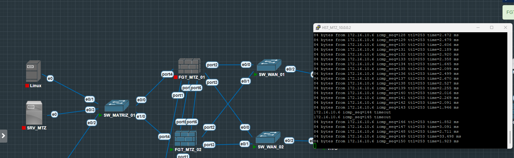
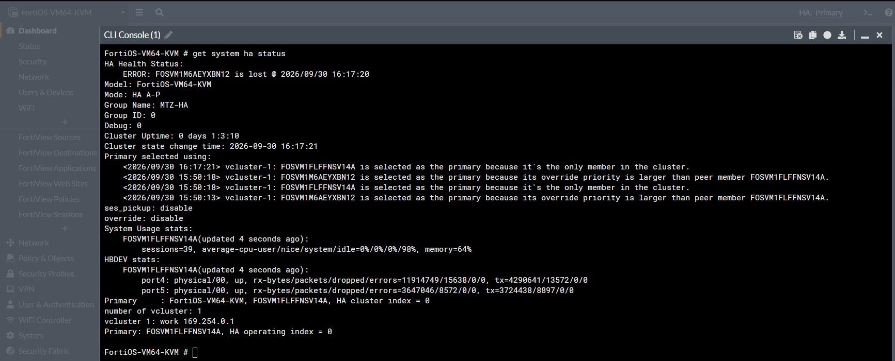
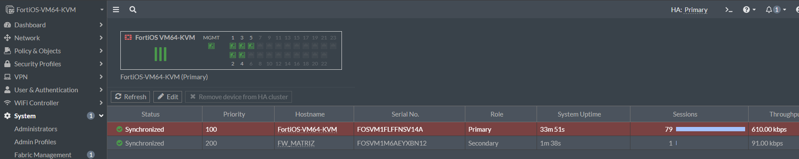
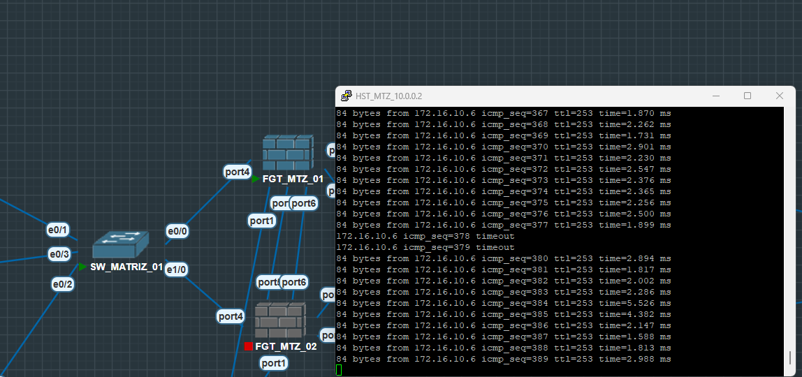

# Testes de failover controlado

**Data do laboratório:** 30/09/2026.  
**Resultado principal:** 2 pacotes ICMP (Internet Control Message Protocol) perdidos em cada teste.

## Condição inicial e método

O cluster da Matriz estava sincronizado, com FGT_MTZ_01 Primary e FGT_MTZ_02 Secondary. Os dois enlaces de heartbeat estavam ativos. Os túneis CLARO_TO_RJ e VIVO_TO_RJ estavam UP antes dos testes.

Foi mantido um ping contínuo de um host da Matriz (10.0.20.1) para o endereço 172.16.10.6, no lado Rio:

```text
ping 172.16.10.6 -c 10000
```

O teste consistiu em desligar somente o firewall ativo no PNETLab, observar os timeouts e confirmar a eleição no outro membro com get system ha status.

## Teste 1 — Desligamento do FGT_MTZ_01

| Etapa | Observação |
|---|---|
| Antes | FGT_MTZ_01 Primary; FGT_MTZ_02 Secondary |
| Falha | FGT_MTZ_01 desligado |
| Eleição | FGT_MTZ_02 assumiu como único membro disponível |
| ICMP | Timeout nas sequências 144 e 145 |
| Recuperação | Resposta retomada na sequência 146 |





Após o retorno do FGT_MTZ_01, o FGT_MTZ_02 permaneceu Primary e o FGT_MTZ_01 entrou como Secondary. Ambos ficaram sincronizados. Com `override disable`, o retorno do membro de prioridade 200 não provocou a troca automática do Primary.



## Teste 2 — Desligamento do FGT_MTZ_02

Com o FGT_MTZ_01 reintegrado e sincronizado, foi desligado o FGT_MTZ_02, então Primary.

| Etapa | Observação |
|---|---|
| Antes | FGT_MTZ_02 Primary; FGT_MTZ_01 Secondary |
| Falha | FGT_MTZ_02 desligado |
| Eleição | FGT_MTZ_01 assumiu |
| ICMP | Timeout nas sequências 378 e 379 |
| Recuperação | Resposta retomada na sequência 380 |



## Resultado

A comunicação Matriz ↔ Rio de Janeiro foi restabelecida nos dois testes, com perda de 2 pacotes ICMP em cada troca do membro ativo. Após o retorno, o membro foi reintegrado e sincronizado com o cluster.

Os testes avaliaram a eleição do Primary e a recuperação da conectividade ICMP após o desligamento do firewall ativo.

## Testes HA — Rio de Janeiro

O cluster iniciou sincronizado, com FGT_RIO_DE_JANEIRO_01 Primary (prioridade 200) e FGT_RIO_DE_JANEIRO_02 Secondary (prioridade 100), com `override disable`. A conectividade Rio ↔ Matriz foi acompanhada por ICMP durante o desligamento controlado de cada membro ativo.

| Teste | Ação controlada | Novo Primary | Perda ICMP | Resultado |
|---|---|---|---|---|
| Rio 1 | Desligamento do FGT_RIO_DE_JANEIRO_01 Primary | FGT_RIO_DE_JANEIRO_02 | 2 pacotes | Comunicação Rio ↔ Matriz restabelecida |
| Rio 2 | Desligamento do FGT_RIO_DE_JANEIRO_02 Primary | FGT_RIO_DE_JANEIRO_01 | 2 pacotes | Comunicação Rio ↔ Matriz restabelecida |

Entre os testes, o FGT01 foi ligado novamente, entrou como Secondary e sincronizou. Com override desabilitado, sua prioridade 200 não provocou a retomada automática do papel de Primary. Em seguida, o FGT02 ainda ativo foi desligado para validar o failover inverso.

### Reintegração após alteração durante indisponibilidade

Com o FGT02 desligado e o FGT01 Primary, foi realizada uma alteração de configuração no FGT01. Ao ligar novamente o FGT02, o membro retornou ao cluster inicialmente como `Not Synchronized`. Sem sincronização manual, recebeu a configuração atualizada do Primary e passou a `Synchronized`.

O teste validou a reintegração e a ressincronização automática após uma alteração realizada durante a indisponibilidade do Secondary. Ao final, os dois membros estavam sincronizados. A implementação e os testes HA descritos para Matriz e Rio de Janeiro estão concluídos.

[Voltar ao início](../README.md)
